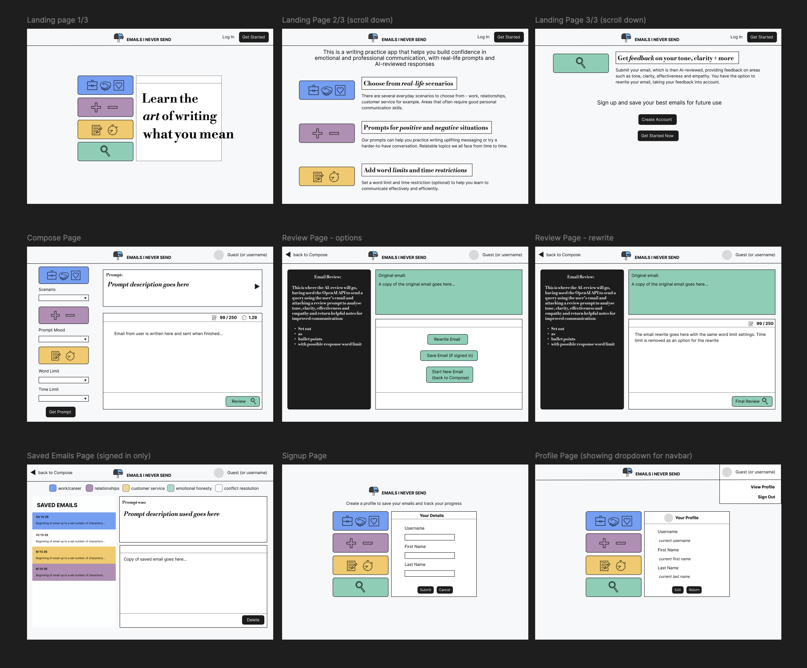

# Emails I Never Send

A writing-practice app that lets users choose from different email scenarios and improve their communication style by reviewing their responses.

## Overview
This project started as a proposal for our final group projects at Dev Academy. Although it wasn’t selected, I decided to continue developing the idea as a personal project. As a creative approach to writing practice, I’ve also been curious about interesting uses of AI and wanted to explore integrating the OpenAI API to provide feedback on written responses.

## Current Progress
- Built Playground.tsx to explore UI components and Tailwind styling
- Created Figma wireframes to map out the MVP user flow

  

## Planned Features
- State-managed options that are used to generate a scenario for the user
- User limits to apply such as word limit or time restraint
- Responses are submitted for review and sent to the OpenAI API using a predefined prompt
- Auth0 authentication and user accounts to be able to save favourite email responses

## Planned Tech Stack
- JavaScript / TypeScript
- React
- Node.js / Express
- Tailwind / shadcn/ui
- SQLite
- OpenAI API

## What I'm Learning
- What’s required to set up and use an OpenAI API key
- How to use license-free icons as effective styling elements

## Project Status
In progress

## Next steps
- Creating migrations and seed data
- Building out components using wireframes as a guide

## Running the Project Locally
```bash
npm install
npm run dev
